# Illustrations et équivalents textuels

Quinze schémas vectoriels originaux, palette P2Enjoy, sans ressource distante.
Les relations sont explicitées ci-dessous et dans les descriptions accessibles
des SVG. Les versions PNG exportées servent au PowerPoint.

## Suivre un geste de bout en bout

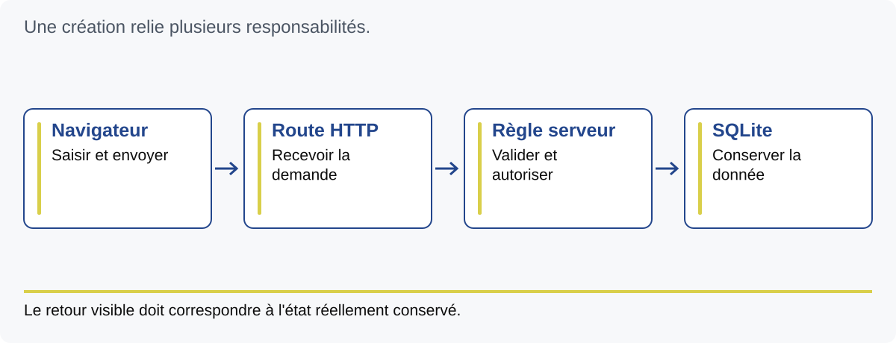

Une création relie plusieurs responsabilités.

- Navigateur : Saisir et envoyer.
- Route HTTP : Recevoir la demande.
- Règle serveur : Valider et autoriser.
- SQLite : Conserver la donnée.

Le retour visible doit correspondre à l'état réellement conservé.

## Quatre lieux, quatre états

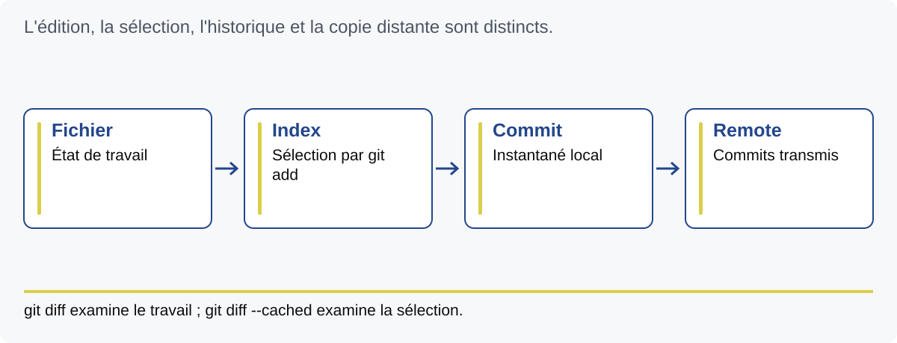

L'édition, la sélection, l'historique et la copie distante sont distincts.

- Fichier : État de travail.
- Index : Sélection par git add.
- Commit : Instantané local.
- Remote : Commits transmis.

git diff examine le travail ; git diff --cached examine la sélection.

## Relier besoin, code et preuve

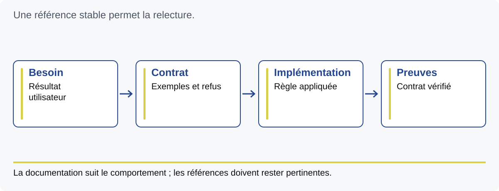

Une référence stable permet la relecture.

- Besoin : Résultat utilisateur.
- Contrat : Exemples et refus.
- Implémentation : Règle appliquée.
- Preuves : Contrat vérifié.

La documentation suit le comportement ; les références doivent rester pertinentes.

## Une règle, plusieurs regards

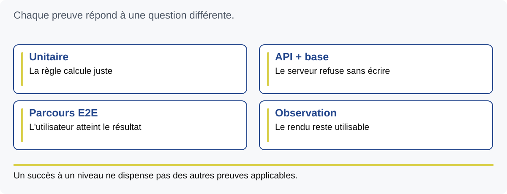

Chaque preuve répond à une question différente.

- Unitaire : La règle calcule juste.
- API + base : Le serveur refuse sans écrire.
- Parcours E2E : L'utilisateur atteint le résultat.
- Observation : Le rendu reste utilisable.

Un succès à un niveau ne dispense pas des autres preuves applicables.

## Qui peut clore cette demande ?

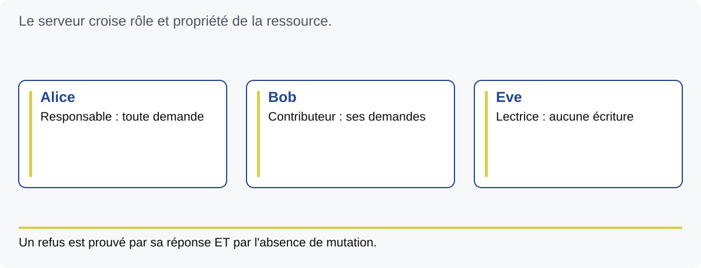

Le serveur croise rôle et propriété de la ressource.

- Alice : Responsable : toute demande.
- Bob : Contributeur : ses demandes.
- Eve : Lectrice : aucune écriture.

Un refus est prouvé par sa réponse ET par l'absence de mutation.

## La mémoire appartient au projet

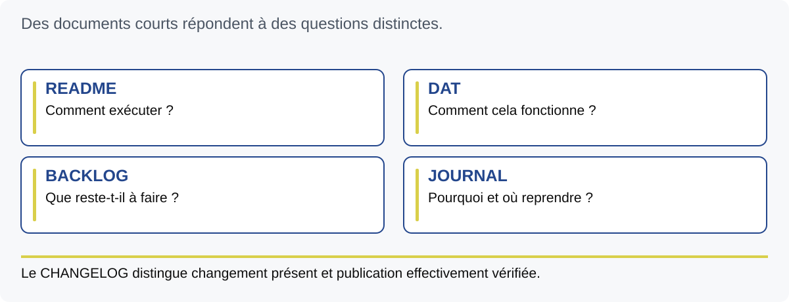

Des documents courts répondent à des questions distinctes.

- README : Comment exécuter ?.
- DAT : Comment cela fonctionne ?.
- BACKLOG : Que reste-t-il à faire ?.
- JOURNAL : Pourquoi et où reprendre ?.

Le CHANGELOG distingue changement présent et publication effectivement vérifiée.

## Méthode partagée, contexte local

Une règle globale se comprend sans connaître le produit.

- Global : Décider, prouver, rendre compte.
- Local : Données, commandes et métier.

CLAUDE.md / CLAUDE_PROJECT.md · DESIGN_SYSTEM / DESIGN_SYSTEM_APP

## Ce que chaque contrôle établit

La forme, le sens et le comportement ont des preuves différentes.

- Instruction : Fixe la règle.
- Hook / CI : Calcule un invariant.
- Revue : Examine la pertinence.
- Exécution : Éprouve le comportement.

Les entrées du contrôle déterminent la portée de son résultat.

## Un responsable, des missions bornées

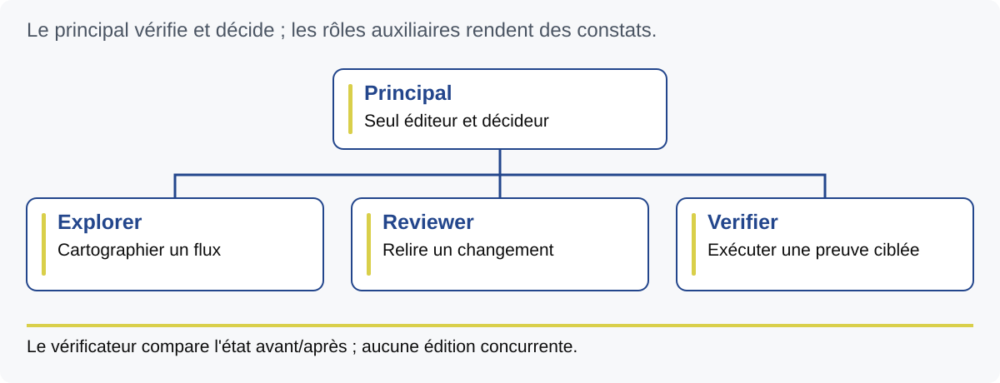

Le principal vérifie et décide ; les rôles auxiliaires rendent des constats.

- Principal : Seul éditeur et décideur.
- Explorer : Cartographier un flux.
- Reviewer : Relire un changement.
- Verifier : Exécuter une preuve ciblée.

Le vérificateur compare l'état avant/après ; aucune édition concurrente.

## Une session qui laisse une reprise

L'état local éphémère doit devenir un état durable vérifiable.

- Récupérer : Code et contexte.
- Réaliser : Une unité cohérente.
- Prouver : Résultats et limites.
- Transmettre : Checkpoint et passation.

Budget, autorité, destination et condition d'arrêt sont explicites.

## L'agent agit dans un environnement

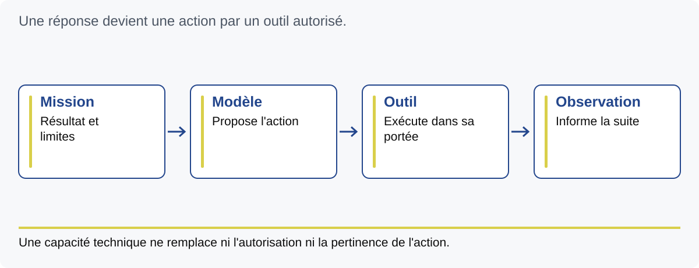

Une réponse devient une action par un outil autorisé.

- Mission : Résultat et limites.
- Modèle : Propose l'action.
- Outil : Exécute dans sa portée.
- Observation : Informe la suite.

Une capacité technique ne remplace ni l'autorisation ni la pertinence de l'action.

## Passer de l'ambition à une unité

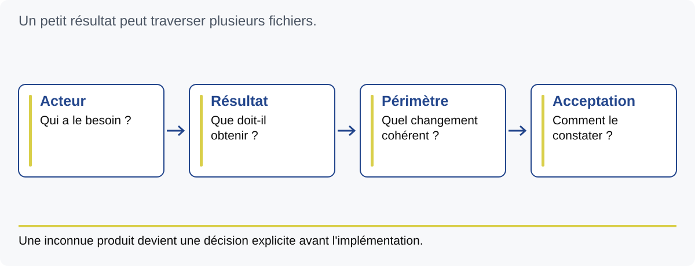

Un petit résultat peut traverser plusieurs fichiers.

- Acteur : Qui a le besoin ?.
- Résultat : Que doit-il obtenir ?.
- Périmètre : Quel changement cohérent ?.
- Acceptation : Comment le constater ?.

Une inconnue produit devient une décision explicite avant l'implémentation.

## La boucle d'exécution d'une unité

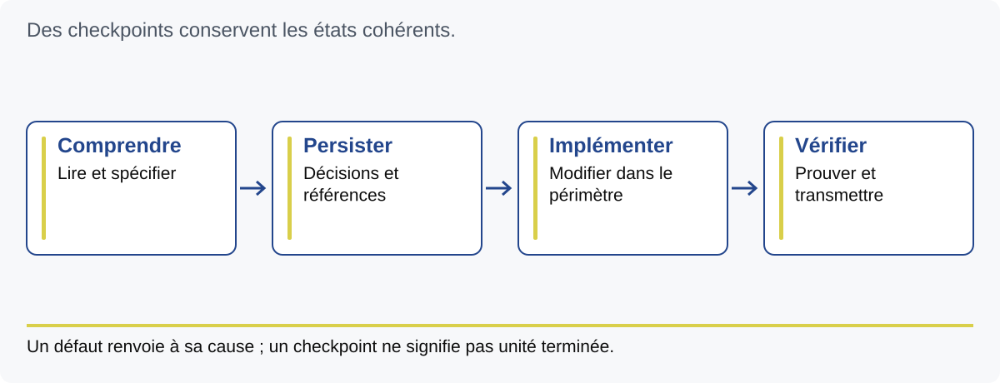

Des checkpoints conservent les états cohérents.

- Comprendre : Lire et spécifier.
- Persister : Décisions et références.
- Implémenter : Modifier dans le périmètre.
- Vérifier : Prouver et transmettre.

Un défaut renvoie à sa cause ; un checkpoint ne signifie pas unité terminée.

## Ce qu'il faut pour reproduire

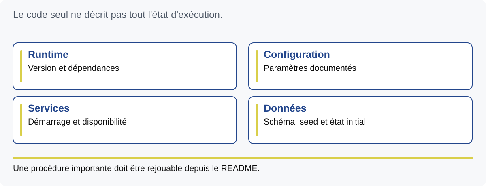

Le code seul ne décrit pas tout l'état d'exécution.

- Runtime : Version et dépendances.
- Configuration : Paramètres documentés.
- Services : Démarrage et disponibilité.
- Données : Schéma, seed et état initial.

Une procédure importante doit être rejouable depuis le README.

## L'usine assemble les acquis

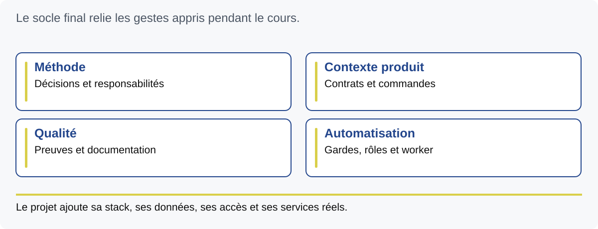

Le socle final relie les gestes appris pendant le cours.

- Méthode : Décisions et responsabilités.
- Contexte produit : Contrats et commandes.
- Qualité : Preuves et documentation.
- Automatisation : Gardes, rôles et worker.

Le projet ajoute sa stack, ses données, ses accès et ses services réels.
