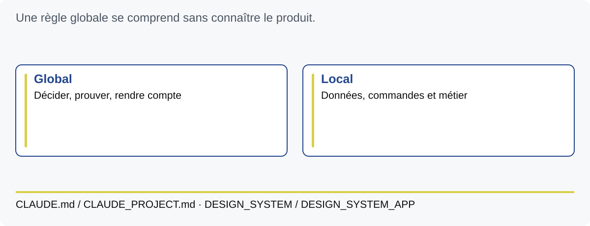

# M5 — Séparer méthode globale et contexte local

Objectif : transformer des pratiques éprouvées en instructions utiles.
Durée animée : 150 min. Exercices E09 et E10.

## Une règle commence par un problème

Vous avez observé le prototype, cadré une unité et testé une passation. Vous
pouvez maintenant écrire des règles reliées à ces
échecs. « Produis du code de qualité » ne dit ni quand agir ni comment vérifier.
« Avant de clore une unité, exécute les tests de son contrat et indique les preuves
manquantes » donne un comportement observable.

Une instruction utile comporte un déclencheur, une action, une preuve et une
limite. Exemple : lorsqu'une règle d'accès change, vérifier côté serveur, tester
un refus avec le profil concerné, vérifier l'absence de mutation et ne pas
remplacer cette preuve par un bouton caché. Les mots forts ne compensent pas
une contradiction entre deux fichiers.

## Global et local

La règle « ne jamais déclarer une preuve non exécutée » est compréhensible sans
connaître notre application. La commande `python3 app.py --port 8765` appartient
au laboratoire. Le socle place les règles générales dans `CLAUDE.md` et le
contexte local dans `CLAUDE_PROJECT.md`. Pour le visuel, il associe
`docs/DESIGN_SYSTEM.md` et `docs/DESIGN_SYSTEM_APP.md`.

Le qualificatif « global » désigne ici la portée réutilisable décidée par P2Enjoy.
Un fichier CLAUDE.md situé dans un dépôt ne devient pas pour autant une préférence
globale installée sur l'ordinateur. Il faut distinguer portée conceptuelle de
la méthode et mécanisme de découverte du logiciel.

## Faire lire les bonnes sources

Codex découvre les fichiers `AGENTS.md` selon la hiérarchie documentée. Dans le
socle, cet adaptateur demande explicitement de lire le contrat général et les
compagnons applicables. Voir la [documentation officielle Codex](https://learn.chatgpt.com/docs/agent-configuration/agents-md).
Claude Code utilise `CLAUDE.md` et ses mécanismes de contexte documentés ;
`AGENTS.md` n'y est pas automatiquement l'équivalent. Voir la
[documentation Claude Code](https://code.claude.com/docs/en/memory).

Le nom `CLAUDE_PROJECT.md` est une convention de cette méthode : il doit être
explicitement demandé ou importé par la configuration pertinente. Ne supposez
pas sa lecture automatique. Vérifiez les fichiers consultés et les actions
produites. Demander à l'agent de reformuler les contraintes est un diagnostic
utile, mais ne prouve pas qu'il les respectera lors de chaque outil.

Pour le laboratoire, E09 fait écrire un adaptateur court et un contrat local
avec les commandes existantes. Les paramètres de sandbox et d'autorisation
restent des paramètres d'outil. Une règle textuelle ne crée pas une barrière
d'accès au système de fichiers ou au réseau.

## Une Definition of Done utilisable

La **Definition of Done** précise quand une unité peut être considérée comme
terminée. Dans le socle : comportement, lisibilité, sécurité, preuves unitaires
et E2E, intégration lorsque pertinente, données, documentation et état Git. Les
exigences applicables sont vérifiées, et une preuve importante absente garde
l'unité en cours.

Pour DEM-02, la clôture exige au minimum : matrice implémentée au serveur,
test unitaire des rôles et propriétaires, test direct du refus avec absence de
mutation, parcours utilisateur, documentation synchronisée. Ne cochez pas
« build » en ayant seulement démarré l'application : le laboratoire n'a pas de
build frontend, et sa vérification de syntaxe porte un autre nom.

Un contrôle mécanique peut repérer un marqueur de spécification. La pertinence
du chapitre cité demande une relecture. Une capture peut exister sans que
quelqu'un l'ait observée. Une case cochée est une déclaration ; le dossier de
preuves permet de l'examiner.

## Gérer le contexte et le coût

Le contexte disponible à un agent est limité et peut être résumé entre deux
étapes. Écrivez les décisions durables, puis chargez les sources utiles à
l'unité. Une longue répétition de règles peut rendre les contradictions plus
difficiles à voir. Conservez un point d'entrée clair, des documents à responsabilité
distincte et des liens stables. L'obligation de lecture intégrale du contrat du
socle reste une convention explicite à respecter quand vous adoptez cette méthode.

Mesurez le coût sur un travail achevé : temps humain, temps de calcul ou usage,
nombre de reprises et qualité obtenue. Une session courte qui produit une erreur
coûte ensuite du diagnostic. Une revue déléguée peut économiser ce diagnostic,
mais elle ajoute sa propre lecture. Fixez un budget de mission et un livrable
borné ; ne supposez pas que davantage d'agents améliore automatiquement le résultat.

## Faire et vérifier

E09 classe les règles et rédige un contrat court. E10 vérifie le routage des
sources et l'absence de duplication. Extension : éliminer les contradictions entre trois
fichiers d'instructions sans réduire les exigences de preuve ou de sécurité.

Q5.1 : « global » dans ce socle signifie-t-il installation automatique sur tous
vos projets ? Q5.2 : qui garantit la pertinence d'une ancre `@spec` ? Q5.3 :
pourquoi faut-il lire les preuves d'une Definition of Done cochée ? Voir les corrigés.

Point de sortie : votre contrat indique comment agir, où chercher le contexte et
comment rendre compte, avec une responsabilité explicite pour chaque document.
