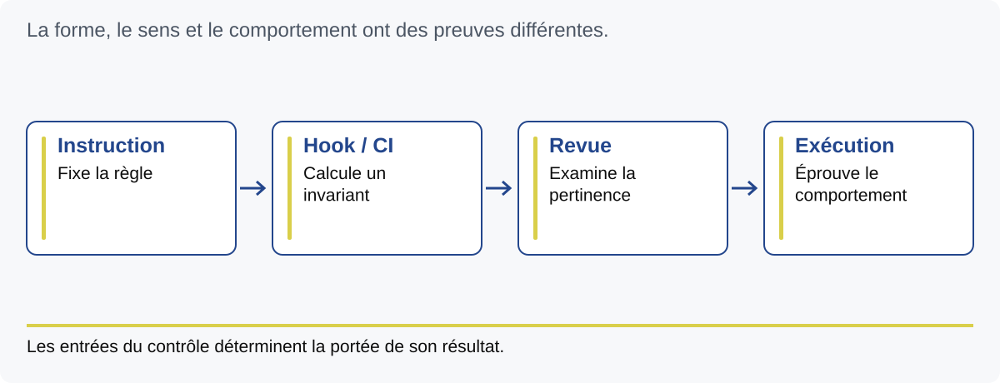

# M13 — Automatiser les invariants

Objectif : distinguer les contrôles mécaniques, leurs entrées et les décisions.
Durée animée : 150 min. Exercices E25 et E26.

## Choisir un invariant calculable

Un invariant est une propriété qui doit rester vraie dans un périmètre défini.
Certaines propriétés se calculent : un champ existe, un diff comporte des
erreurs d'espacement, la destination d'un push est autorisée. D'autres exigent
du jugement : une référence est pertinente, une spécification répond au besoin,
une capture montre une expérience utilisable.

Automatiser une forme donne un filet utile. Il faut dire exactement ce qu'il
attrape. Un marqueur @spec présent ne prouve pas que le comportement est conforme.
Un détecteur de secrets minimal ne certifie pas tout l'historique. Un contrôle
vert dont l'entrée est vide ne démontre pas la validité du changement.

## Les événements Git

Un hook est un programme appelé lors d'un événement Git. Le pre-commit examine
des éléments avant le commit ; commit-msg reçoit un fichier de message ;
pre-push reçoit les références liées au push. La documentation
[Git hooks](https://git-scm.com/docs/githooks) explique ces contrats d'entrée.
Les scripts versionnés ne sont pas activés automatiquement par le clone.

Dans ce socle, les adaptateurs .githooks appellent les scripts de scripts/git-hooks.
La commande install configure leur chemin et un mode, avec une baseline locale.
Elle refuse de remplacer un autre chemin de hooks déjà configuré. Elle ne
configure pas l'identité : les gardes exigent que celle du responsable soit
déclarée localement et corresponde à l'auteur et au committer effectifs.

Le précommit lit les blobs indexés. Si vous ajoutez un marqueur au fichier après
git add, le contenu de l'index reste ancien. Relisez puis réindexez la sélection
voulue. Ne confondez pas l'éditeur, l'index et le commit, étudiés au module 11.
Les scripts vérifient une forme de traçabilité et quelques secrets à forte
confiance ; la revue et les preuves complètent ces contrôles.

## Une CI avec les bonnes entrées

La CI exécute automatiquement des contrôles dans un environnement de référence.
Elle peut porter les protections faisant autorité lorsque les contrôles locaux
sont contournables. Le socle fournit des scripts réutilisables mais aucun
workflow CI distant. Le projet configure ses jobs, ses entrées et ses protections.

Un piège concret : exécuter check-staged dans un checkout sans changement indexé.
Le script ne voit alors pas les blobs que vous espérez vérifier. Il faut préparer
les entrées attendues ou choisir un contrôle qui examine explicitement les
fichiers du changement. Le message vert doit décrire ce qui a été réellement
inspecté. Une campagne de tests ne remplace pas non plus le contrôle de cible.

Le point d'extension project-pre-commit porte les contrôles rapides propres à
la stack. Son contrat n'autorise pas une longue campagne E2E ou une opération
réseau. Ce sont des contraintes de workflow à respecter : l'appel d'un script
ne démontre pas qu'un mécanisme technique limite toutes ses capacités.

## Destination et fin de session

En mode worker, les gardes du socle contraignent notamment main, origin/main,
les mises à jour fast-forward et l'absence de suppression. Elles interviennent
aux événements contrôlés ; elles n'empêchent pas à elles seules toute commande
Git imaginable entre ces événements.

La fin d'une session n'est pas un événement Git. Le socle prévoit une commande
check-session explicite, qui vérifie notamment l'arbre propre et l'égalité de
HEAD avec la référence locale origin/main. Le fetch qui actualise cette
référence se fait séparément. Une garde verte sans actualisation récente n'est
pas une observation actuelle du serveur distant.

## Démontrer un garde-fou

Pour éprouver un hook, préparer un petit dépôt de test isolé, un cas accepté
et un cas refusé. Utiliser uniquement des identités fictives et un remote local
de test lorsque le scénario l'exige. Ne modifier aucune configuration partagée.
Le harnais du socle suit ce principe dans des répertoires temporaires.
Dans les exercices du cours, on analyse les scripts et leurs entrées ; aucune
activation n'est nécessaire dans le dépôt des supports.

Le résultat utile nomme la propriété, l'entrée, le refus attendu et la limite.
Il peut ensuite être relié au contrat de méthode. L'étape suivante est de
composer ces contrôles dans un cycle de worker, étudié au module 14.

## Faire et vérifier

E25 cartographie trois événements et leurs preuves. E26 diagnostique quatre
faux raisonnements autour de l'index, de la CI, de la référence distante et de
la baseline. Extension : définir un contrôle CI sur l'ensemble des fichiers
changés avec ses cas de suppression et de renommage.

Q13.1 : un clone active-t-il les hooks ? Q13.2 : pourquoi un index vide peut-il
donner une conclusion trompeuse ? Q13.3 : qui vérifie le sens d'une référence ?
Voir [CORRIGES](../CORRIGES.md).

Point de sortie : chaque contrôle annoncé possède une entrée, une propriété
et une limite explicitement nommées.
