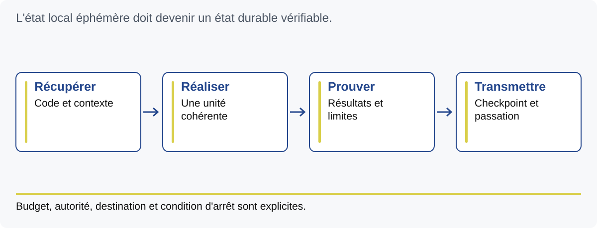

# M14 — Passer au worker autonome

Objectif : définir un cycle capable de reprendre après interruption et de s'arrêter.
Durée animée : 150 min. Exercices E27 et E28.

## Une session sans présence humaine immédiate

Un worker est un exécutant qui prend une unité et suit un protocole. Une
planification peut lancer ce protocole à une cadence déterminée. L'autonomie
repose sur les connaissances, preuves et limites construites depuis M1 : sans
contrat précis ou commandes fiables, la répétition multiplie l'incertitude.

Le socle décrit un worker sur checkout éphémère. La machine suivante repart
d'un dépôt récupéré ; ce qui reste seulement sur le disque de l'ancienne
session peut disparaître. La règle de persistance impose des checkpoints
durables et une passation fidèle. La présence de `docs/.routine` n'installe
pas un ordonnanceur : ce fichier contient le prompt d'entrée.

## Les entrées de la session

Le worker doit connaître la source du code, l'état Git, les commandes du projet,
le backlog, le journal, ses droits et son budget. La récupération du travail
antérieur précède les nouvelles modifications. L'environnement est préparé
avec les commandes documentées et les données attendues. Une session choisit
ensuite une unité cohérente, selon la priorité prévue.

Ne supposez pas que tout environnement distant est root, possède Docker ou
utilise un chemin de navigateur précis. Le texte actuel de CloudWorker contient
ces hypothèses d'hôte. Elles doivent être identifiées et adaptées par une
configuration autorisée avant un usage réel. Elles ne sont pas exécutées dans
le laboratoire de cette formation.

## Les états durables

Après lecture et spécification, le worker conserve un checkpoint. Pendant
l'implémentation, il persiste les morceaux cohérents. Il exécute les preuves
ciblées puis la campagne finale prévue. Si la preuve n'est pas terminée,
le backlog reste `[~]` et la passation indique quoi rejouer. « Poussé » et
« terminé » désignent deux informations distinctes.

Avant d'envoyer des commits, établir le remote autorisé et l'effet du push.
Une destination qui déclenche un déploiement automatique ne peut pas recevoir
un checkpoint incomplet par simple habitude. Le protocole de sauvegarde et
les règles de livraison doivent être compatibles. Les droits de production,
secrets et dépenses restent soumis à leur autorité explicite.

La garde finale du socle vérifie notamment la branche, les hooks en mode worker,
le statut propre et l'égalité HEAD/origin/main. Cette dernière référence est
locale : le fetch fait partie d'une étape distincte. Si la synchronisation
modifie le code, les preuves affectées doivent être rejouées avant la conclusion.

## Budget, observation et arrêt

Un budget contient du temps pour les preuves, la correction et la passation.
Les durées doivent venir de mesures du projet. Les 40–70 minutes mentionnées
dans le document du worker ne sont pas une durée universelle de tests.
Si la campagne excède le temps disponible, on décrit exactement la partie
exécutée et on garde le statut incomplet.

Le journal nomme unité, décisions, résultats et prochaine action. Des logs
exploitables peuvent aider à diagnostiquer la session, mais ne doivent pas
conserver des secrets ou des données personnelles inutiles. Un identifiant
de session et une référence de code facilitent la liaison entre commande et
résultat. L'observabilité doit servir une question opérationnelle.

L'arrêt a lui aussi un contrat : objectif atteint, ou dépendance indispensable
sans option autorisée pour poursuivre. Il doit nommer la cause et l'état restant.
Lorsqu'une tâche planifiée réelle existe, conclure dans le chat ne la désactive
pas nécessairement. Son mécanisme de planification possède son propre contrôle
de cycle de vie. Ce cours simule ce geste sans créer de service extérieur.

## Éprouver une interruption

Sur table, prévoir une session de 30 minutes : diagnostic 3, contrat 5, code 8,
preuves 8, passation 4, réserve 2. Une interruption à la minute 18 intervient
pendant les preuves. Quelles données un nouveau worker pourra-t-il lire ?
Le code cohérent et la spécification doivent être conservés, les preuves déjà
obtenues nommées, les autres restant à exécuter.

Un test de reprise consiste à ouvrir une nouvelle session et ne lui donner que
ces fichiers. Vérifier qu'elle ne recode pas l'unité déjà livrée et qu'elle
ne coche pas une preuve absente. La simulation permet de corriger le protocole
avant toute planification réelle.

## Faire et vérifier

E27 établit les prérequis d'un worker. E28 simule l'interruption et l'arrêt.
Extension : proposer une mesure de progression qui porte sur les comportements
prouvés plutôt que sur le volume de texte ou le nombre de commits.

Q14.1 : que garantit un fichier `.routine` présent ? Q14.2 : que manque-t-il à
un commit local dans un checkout éphémère ? Q14.3 : que faire si la synchronisation
change le code après les tests ? Voir [CORRIGES](../CORRIGES.md).

Point de sortie : la session suivante peut reprendre un état réel, avec ses
limites, et la boucle dispose d'une condition d'arrêt explicite.
